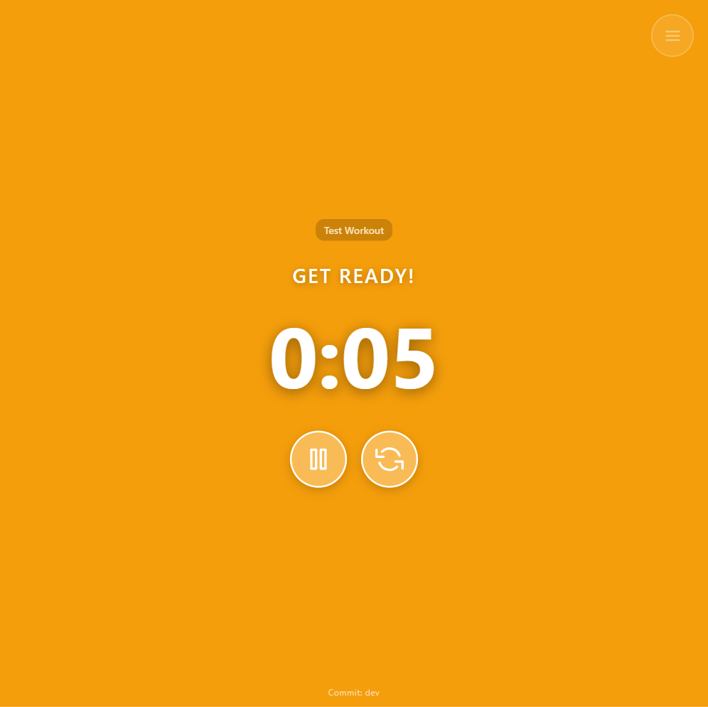
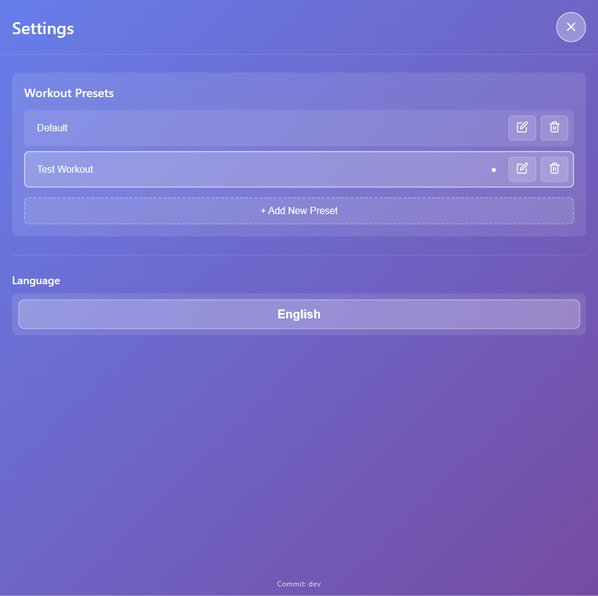
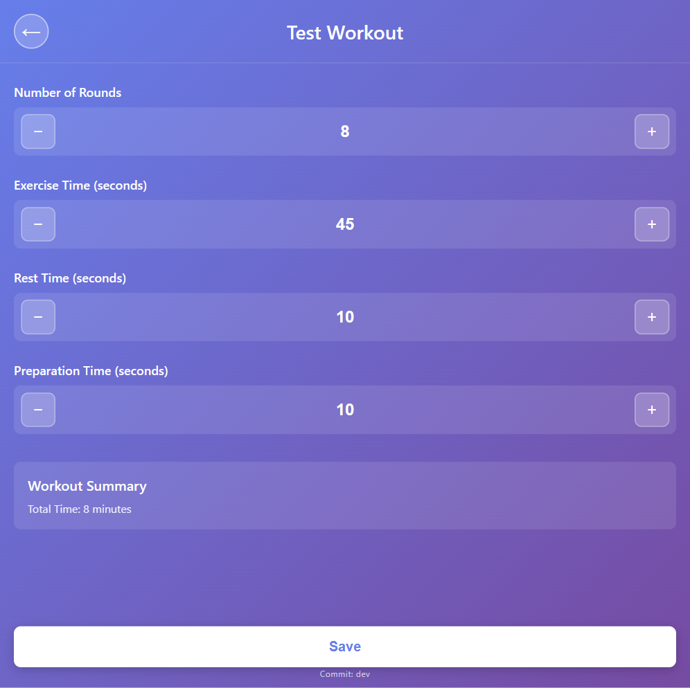

# HIIT Timer - High-Intensity Interval Training Timer

A Progressive Web App (PWA) for High-Intensity Interval Training (HIIT) workouts. Built with React and TypeScript, optimized for mobile devices, especially iPhones.

## ⚠️ Disclaimers

### About This Project
- **This is just a playground** - This project is an experimental space for learning and exploration
- **Goal**: Learn what AI and Copilot can already achieve in software development
- **Developer Background**: I'm neither a React/TypeScript developer nor will I ever be - this entire project was created with AI assistance

### Usage Notice
- **AI Showcase**: This is a demonstration of what AI-powered development can accomplish
- **Use at Your Own Risk**: This application is provided as-is without any warranties
- **No Liability**: The author(s) assume no responsibility or liability for any errors, omissions, or results obtained from the use of this application. This software is provided "as is" without warranty of any kind, either express or implied. Use of this application is at your sole risk.

### Health & Fitness Disclaimer
- **Not Medical Advice**: This application is not intended to provide medical advice or replace professional medical consultation
- **Physical Activity Risks**: High-intensity interval training and exercise can be strenuous and may carry risks of physical injury
- **Consult Your Doctor**: Before beginning any exercise program, consult with a healthcare professional, especially if you have any pre-existing health conditions, injuries, or concerns
- **No Health Liability**: The developer assumes no responsibility or liability for any physical injuries, health conditions, or medical issues that may result from using this application or following any workout routines
- **Know Your Limits**: Users are solely responsible for knowing their physical limitations and exercising safely within their capabilities

## Features

### Core Timer Features
- **Visual Timer Display**: Large, high-contrast timer display for easy visibility during workouts
- **Color-Coded Phases**:
  - 🔴 Red background during exercise periods
  - 🟢 Green background during rest periods
  - 🟡 Yellow background during preparation phase
  - ⚪ Gray background in ready state
- **Auto-Progression**: Automatically transitions between exercise and rest phases
- **Workout Control**: Pause, resume, and reset timer functionality with professional SVG icons

### Preset Management (New!)
- **Multiple Workout Presets**: Create, save, and manage multiple named workout configurations
- **Quick Preset Switching**: Switch between presets directly from the main screen (only in ready state)
- **Preset Customization**: Each preset stores its own:
  - Number of rounds (1-50)
  - Exercise time (5-600 seconds)
  - Rest time (5-300 seconds)
  - Preparation time (0-300 seconds)
- **Preset Management UI**: Rename, delete, and create presets in the Settings screen
- **Default Preset**: A "Default" preset is created on first launch with standard values

### Additional Features
- **Workout Summary**: See total workout duration at a glance
- **Mobile-Optimized**: Responsive design focused on iPhone and mobile devices
- **PWA Support**: Install on your home screen for app-like experience
- **Offline Ready**: Works without internet connection once installed
- **Multilingual Support**: Available in English and German, with automatic browser language detection

## Screenshots

### Main Screen with Preset Selector & SVG Icons

- Preset dropdown to quickly switch between configured workouts
- Only available when timer is in ready state
- Professional SVG icons for all buttons

### Timer in Action (Preparation Phase)

- Yellow background indicates preparation phase (countdown before exercise starts)
- Pause button (two bars icon) to pause the timer
- Reset button (refresh arrow icon) to return to ready state
- All controls use clean SVG icons for better visual integration

### Workout Presets Management

- Create new presets with the "+ Add New Preset" button
- Rename existing presets with the pencil edit icon
- Delete presets with the trash icon (at least one preset must remain)
- Active preset is marked with a bullet point (●)
- Close button uses an X icon (top right)

### Preset Editor

- Configure all parameters for a selected preset
- Adjust number of rounds, exercise time, rest time, and preparation time
- View total workout duration in the summary section
- Changes are automatically saved

### Original Timer Screens
For reference, the original timer display screens:

**Ready State** (Gray background)


**Exercise Phase** (Red background)


**Rest Phase** (Green background)


## Getting Started

### Prerequisites

- Node.js (v18 or higher recommended)
- npm (comes with Node.js)

### Installation

1. Clone the repository:
```bash
git clone https://github.com/florian-d/Fitness-Timer.git
cd Fitness-Timer
```

2. Install dependencies:
```bash
npm install
```

3. Start the development server:
```bash
npm start
```

4. Open [http://localhost:3000](http://localhost:3000) in your browser

### Building for Production

```bash
npm run build
```

The optimized production build will be in the `build/` folder.

## Usage

### Switching Between Presets
1. On the main screen, use the **preset dropdown** to select your desired workout configuration
2. Only available when the timer is in **ready state** (not running)
3. Each preset has its own saved settings

### Creating a New Preset
1. **Open Settings**: Tap the menu button (☰) in the top right corner
2. **Go to Presets**: In the "Workout-Presets" section, tap **"+ Neues Preset hinzufügen"**
3. **Enter a Name**: Provide a unique name for your preset
4. **Configure Settings**: The preset will be created with default values
5. **Edit if Needed**: Tap on the preset to customize the workout parameters

### Configuring a Preset
1. **Open Settings**: Tap the menu button (☰) in the top right corner
2. **Select a Preset**: Tap on the preset name you want to configure
3. **Adjust Parameters**:
   - Set the number of rounds (1-50)
   - Set exercise time in seconds (5-600)
   - Set rest time in seconds (5-300)
   - Set preparation time in seconds (0-300)
   - View total workout duration in the summary
4. **Save**: Tap the "Speichern" button to save changes
5. **Back**: Tap the back arrow (←) to return to the preset list

### Managing Presets
- **Rename**: Tap the pencil (✏) icon next to a preset
- **Delete**: Tap the trash can (🗑) icon (at least one preset must remain)
- **Select Active**: Tap on a preset name to make it the active preset

### Running a Workout
1. **Select Preset**: Choose your desired preset from the dropdown on the main screen
2. **Begin Workout**: Tap the play button (▶ icon) to start the timer
3. **Control Timer**:
   - Pause/Resume: Tap the pause button (‖ icon) to pause, or play button (▶ icon) to resume
   - Reset: Tap the reset button (⟳ refresh icon) to return to ready state
4. **Phase Indicators**: The background color changes with each phase:
   - Gray = Ready
   - Yellow = Preparation (countdown before exercise begins)
   - Red = Exercise
   - Green = Rest
   - Blue = Complete

## Testing

Run the test suite:
```bash
npm test
```

Run tests with coverage:
```bash
npm test -- --coverage --watchAll=false
```

## PWA Installation on iPhone

1. Open the app in Safari
2. Tap the Share button
3. Scroll down and tap "Add to Home Screen"
4. Tap "Add" to confirm

The app will now appear on your home screen and can be launched like a native app.

## Technologies Used

- **React 18** - UI framework
- **TypeScript** - Type-safe development
- **React Scripts** - Build tooling
- **Workbox** - Service worker and PWA support
- **Jest & React Testing Library** - Testing
- **GitHub Actions** - CI/CD pipeline

## CI/CD

The project includes GitHub Actions workflows:

### Continuous Integration (CI)
- Runs tests on Node.js 18.x and 20.x
- Builds the application
- Deploys to GitHub Pages on push to main branch

### Release Deployment (FTP)
- Automatically deploys the app to hosting provider via FTP
- Triggered on Git tags (e.g., `v1.0.0`) or GitHub releases
- Can also be manually triggered

For detailed setup instructions, see [FTP Deployment Guide](docs/FTP_DEPLOYMENT.md)

## License

This project is open source and available under the MIT License.

## Contributing

Contributions are welcome! Please feel free to submit a Pull Request.